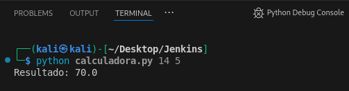
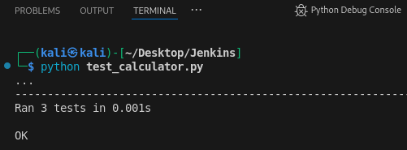

## 🧩 RA5_1_1 - Desarrollo de una Calculadora de Multiplicación en Python

### 🎯 Objetivo

Esta tarea consiste en desarrollar una pequeña aplicación en Python que reciba **dos números desde la línea de comandos** y devuelva el resultado de su multiplicación. Además, se implementarán **pruebas unitarias** con la biblioteca `unittest` para garantizar la correcta funcionalidad del método de multiplicación. Finalmente, se publicará el proyecto en GitHub.

---

### 📁 Archivos requeridos

- `calculadora.py`: contiene la clase principal `Calculadora` y la lógica para recibir argumentos desde la línea de comandos.
- `test_calculator.py`: contiene las pruebas unitarias que validan la operación de multiplicación.

---

### 📌 Contenido de [calculadora.py](/calculadora.py)

```python
class Calculadora:
    def multiplicar(self, a, b):
        return a * b

if __name__ == "__main__":
    import sys

    if len(sys.argv) != 3:
        print("Uso: python calculadora.py <número1> <número2>")
        sys.exit(1)

    try:
        num1 = float(sys.argv[1])
        num2 = float(sys.argv[2])
    except ValueError:
        print("Por favor, ingresa dos números válidos.")
        sys.exit(1)

    calc = Calculadora()
    resultado = calc.multiplicar(num1, num2)
    print(f"Resultado: {resultado}")
```

---

### 🧪 Pruebas unitarias [test_calculator.py](/test_calculator.py)

```python
import unittest
from calculadora import Calculadora

class TestCalculadora(unittest.TestCase):
    def setUp(self):
        self.calc = Calculadora()

    def test_multiplicar_enteros(self):
        self.assertEqual(self.calc.multiplicar(3, 4), 12)

    def test_multiplicar_flotantes(self):
        self.assertAlmostEqual(self.calc.multiplicar(2.5, 4.0), 10.0)

    def test_multiplicar_por_cero(self):
        self.assertEqual(self.calc.multiplicar(0, 100), 0)

if __name__ == '__main__':
    unittest.main()
```

---

### ▶️ Ejecución de las pruebas

```bash
python calculadora.py 14 5
```
 

 
```bash
python test_calculator.py
```
 

---

## 📎 Recursos

- [unittest (Python docs)](https://docs.python.org/library/unittest.html)
- [Clases en Python (W3Schools)](https://www.w3schools.com/python/python_classes.asp)
