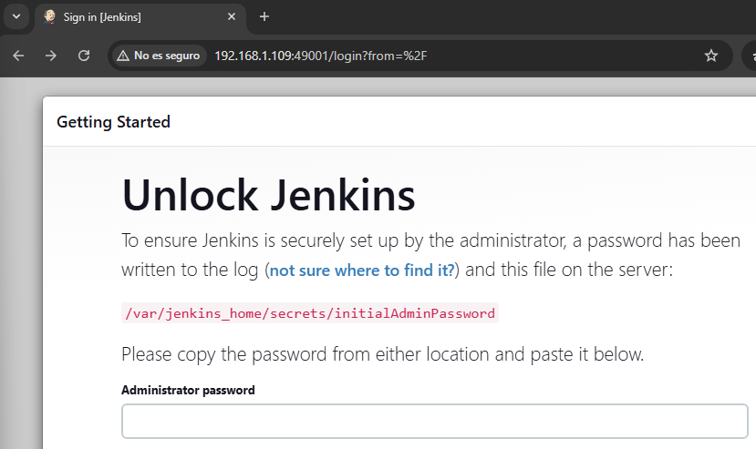
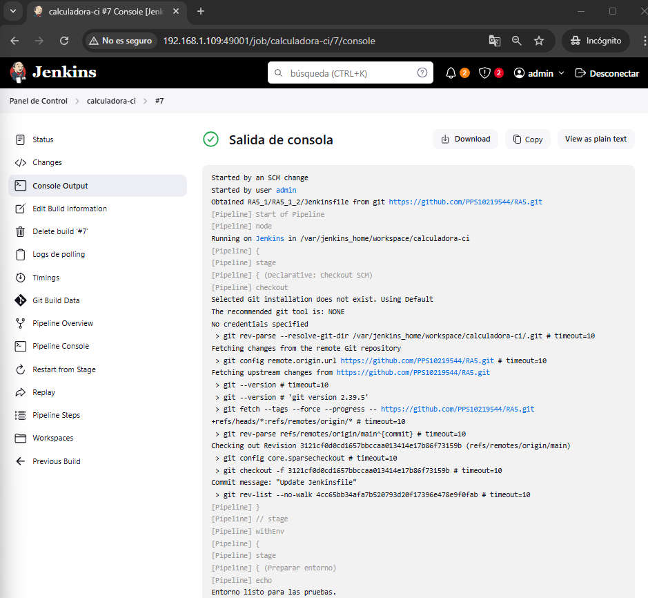
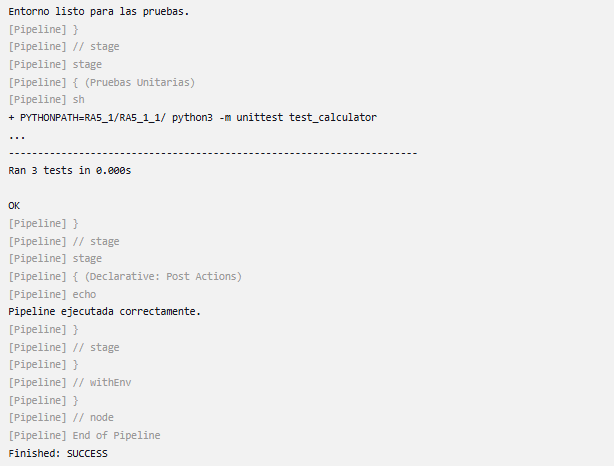
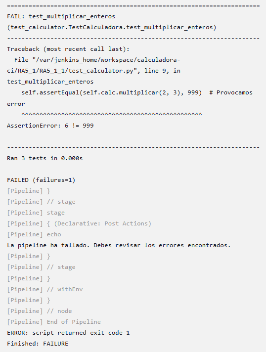

# 🧪 RA5_1_2 - Jenkins CI Pipeline para Calculadora Python

## 🎯 Objetivo

El objetivo de esta tarea es poner en práctica el enfoque de **Integración Continua (CI)** mediante la automatización del proceso de pruebas de un proyecto en Python utilizando Jenkins. Para ello, se implementará una **pipeline declarativa** descrita en un archivo `Jenkinsfile`, que será gestionada desde el propio repositorio Git del proyecto.

La canalización debe ejecutarse de forma automática cada vez que se realicen cambios (commits) en el código, permitiendo:

* Detectar errores de manera temprana.
* Asegurar que las pruebas unitarias se ejecuten correctamente.
* Verificar la estabilidad del proyecto tras cada actualización.

De este modo, se afianza el principio de **"Pipeline as Code"**, donde toda la lógica de construcción y prueba del software es mantenida de forma versionada, transparente y reproducible.

--- 
 
## 🛠️ Preparativos

### 📁 Estructura esperada del repositorio

```
RA5/
├── RA5_1_1/
│   ├── calculadora.py
│   └── test_calculator.py
├── RA5_1_2/
│   └── Jenkinsfile
```

### 📌 Código de [`calculadora.py`](../RA5_1_1/calculadora.py)

### 📌 Código de [`test_calculator.py`](../RA5_1_1/test_calculator.py)

---

## 📜 [Jenkinsfile](./Jenkinsfile)

```groovy
pipeline {
    agent any

    triggers {
        pollSCM('* * * * *')
    }

    stages {
        stage('Preparar entorno') {
            steps {
                echo 'Entorno listo para las pruebas.'
            }
        }

        stage('Pruebas Unitarias') {
            steps {
                sh 'PYTHONPATH=RA5_1/RA5_1_1/ python3 -m unittest test_calculator'
            }
        }
    }

    post {
        success {
            echo 'La pipeline se ha ejecutado correctamente.'
        }
        failure {
            echo 'La pipeline ha fallado. Debes revisar los errores encontrados.'
        }
    }
}
```

---

## 🚀 Montar y Ejecutar Jenkins con tu pipeline

### 🔧 PASO 1: Instalar Docker (si no lo tienes)

Si ya tienes Docker instalado, sáltate este paso. Si no:

```bash
sudo apt update
sudo apt install docker docker.io docker-compose -y
sudo systemctl enable docker
sudo systemctl start docker
sudo usermod -aG docker $USER
sudo init 6
```

> 🔁 Reinicia la sesión para aplicar el grupo docker.
 
### 📦 PASO 2: Crear volumen para Jenkins

```bash
mkdir $HOME/jenkins_home
sudo chown 1000:1000 $HOME/jenkins_home
```

Esto evita problemas de permisos dentro del contenedor.

### 🐳 PASO 3: Lanzar Jenkins con Docker

```bash
sudo docker run -d -p 49001:8080 -v $HOME/jenkins_home:/var/jenkins_home --name jenkins jenkins/jenkins:lts-jdk11
```

> Accede desde tu navegador: `http://192.168.1.109:49001`

 

### 🔑 PASO 4: Obtener la contraseña inicial

```bash
docker exec jenkins cat /var/jenkins_home/secrets/initialAdminPassword
```

Pega esa contraseña en el navegador para desbloquear Jenkins.

### 📦 PASO 5: Instala plugins sugeridos

Durante la instalación, elige **“Instalar plugins sugeridos”** y luego crea tu usuario admin.

### ➕ PASO 6: Crear un nuevo pipeline

Haz clic en “Nuevo Item”.

* Ponle nombre (por ejemplo: `calculadora-ci`).
* Selecciona “Pipeline” y haz clic en OK.

### 🔁 PASO 7: Configurar la pipeline con Git

* **Definition**: `Pipeline script from SCM`
* **SCM**: Git
* **Repository URL**: `https://github.com/PPS10219544/RA5.git`
* **Branch Specifier**: `*/main`
* **Script Path**: `RA5_1_2/Jenkinsfile`

Haz click en "Guardar".

### 🐍 PASO 8: Instalar Python en Jenkins (si es necesario) 

Si el contenedor Jenkins no tiene `python3`, entra como root:

```bash
sudo docker exec -u 0 -it jenkins bash
```

Actualiza e instala Python dentro de este contenedor:
```bash
apt update
apt install -y python3 python3-pip
exit
```

### ▶️ PASO 9: Ejecutar la pipeline

Haz clic en "Build Now" para lanzar la ejecución.

- Jenkins clona el repositorio.
- Lee y ejecuta el Jenkinsfile.
- Muestra resultado en etapas (verde = éxito, rojo = fallo).
 
 

 


### 💥 PASO 10: Probar con error

Edita `test_calculator.py` con un test fallido:

```python
self.assertEqual(multiplicar(2, 3), 999)
```

Vuelve a ejecutar la pipeline, mostrando el error.


 
--- 

## ✅ Conclusión

Esta tarea demuestra cómo integrar un proyecto en Python con Jenkins usando pipelines declarativas y pruebas automatizadas, controladas por cambios en Git. Además, se aprendió a corregir errores comunes relacionados con entornos, rutas y ejecución de scripts de test.

--- 
 
## 📚 Recursos

- [Guía oficial](https://psegarrac.github.io/Ciberseguridad-PePS/tema5/cd/ci/2022/01/13/jenkins.html#tareas)
- [Jenkins](https://www.jenkins.io)
- [Ejemplos Jenkinsfile](https://github.com/jenkinsci/pipeline-examples)
