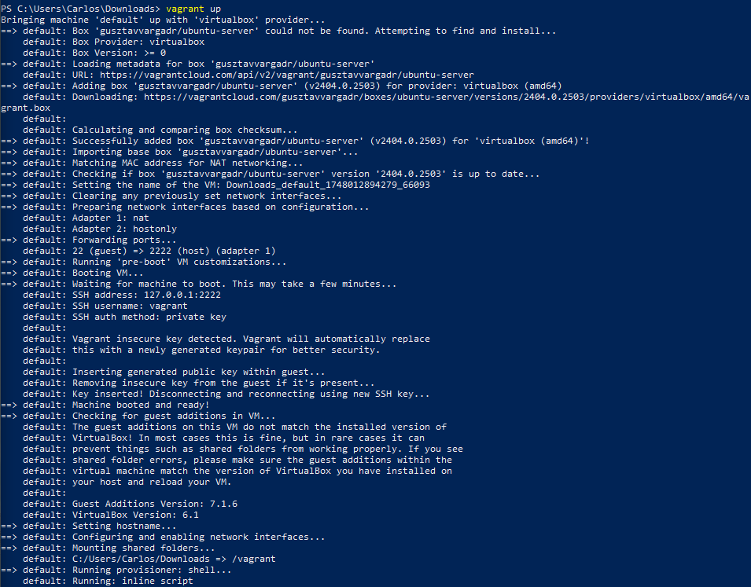

# RA5.2 - Automatización de Infraestructura con Vagrant y Ansible

Este repositorio demuestra cómo implementar **Infrastructure as Code (IaC)** para desplegar y configurar automáticamente una máquina virtual Ubuntu 24.04 LTS utilizando **Vagrant** y **Ansible**.

---

## 📦 Requisitos

Antes de comenzar, nos aseguramos de tener instaladas las siguientes herramientas:

- [VirtualBox](https://www.virtualbox.org/)
- [Vagrant](https://www.vagrantup.com/)
- [Ansible](https://www.ansible.com/)

---

## 🔧 Paso 1: Provisionar Ubuntu 24.04 con Vagrant

El archivo [Vagrantfile](Vagrantfile) define la creación de una máquina virtual con Ubuntu 24.04.

```ruby
Vagrant.configure("2") do |config|
  config.vm.box = "gusztavvargadr/ubuntu-server"
  config.vm.hostname = "vagrantansiblevm"
  config.vm.network "private_network", ip: "192.168.56.10"

  config.vm.provider "virtualbox" do |vb|
    vb.memory = "2048"
    vb.cpus = 2
  end

  config.vm.provision "shell", inline: <<-SHELL
    apt-get update -y
    apt-get install -y python3 python3-apt
  SHELL
end
```

### ✅ Instrucciones

```bash
vagrant up
```

 

---

## ⚙️ Paso 2: Configurar la VM con Ansible (playbook.yml)

Este `playbook.yml` realiza:
 - La actualización del sistema (`apt update && apt upgrade`).
 - La instalación del servidor Apache.

### ✅ Instrucciones

```bash
ansible-playbook -i provision/hosts.ini provision/playbook.yml
```

📂 [playbook.yml](playbook.yml) 

```yaml
- hosts: all
  become: true
  tasks:
    - name: Actualizar el sistema
      apt:
        update_cache: yes
        upgrade: dist

    - name: Instalar Apache
      apt:
        name: apache2
        state: present
```

---

## 📝 Paso 3: Añadir index.html y verificar con curl (index.yml)

Este `playbook.yml` realiza:
 - Crea un archivo `index.html` con el texto “Ansible rocks”.
 - Reinicia el servicio Apache.
 - Verifica la respuesta con `curl`.

📂 [index.yml](index.yml) 

```yaml
- hosts: all
  become: true
  tasks:
    - name: Crear index.html con contenido personalizado
      copy:
        dest: /var/www/html/index.html
        content: "Ansible rocks"

    - name: Reiniciar Apache
      service:
        name: apache2
        state: restarted

    - name: Verificar contenido con curl
      shell: curl -s http://localhost
      register: curl_output

    - name: Mostrar resultado curl
      debug:
        msg: "{{ curl_output.stdout }}"
```

---

## 🧹 Limpieza

Para destruir la máquina virtual y liberar recursos: 

```bash
vagrant destroy -f
```

## 📚 Recursos
- [Documentación de Vagrant](https://developer.hashicorp.com/vagrant)
- [Documentación de Ansible](https://docs.ansible.com/)
- [Creación de entornos de integración con Ansible y Vagrant](https://adictosaltrabajo.com/2015/09/04/creacion-de-entornos-de-integracion-con-ansible-y-vagrant/)
- [Vagrant + Ansible](https://www.rootdesdezero.com/vagrantansible/)
- [Vagrant Cloud - Ubuntu Server 24.04](https://portal.cloud.hashicorp.com/vagrant/discover/gusztavvargadr/ubuntu-server)
