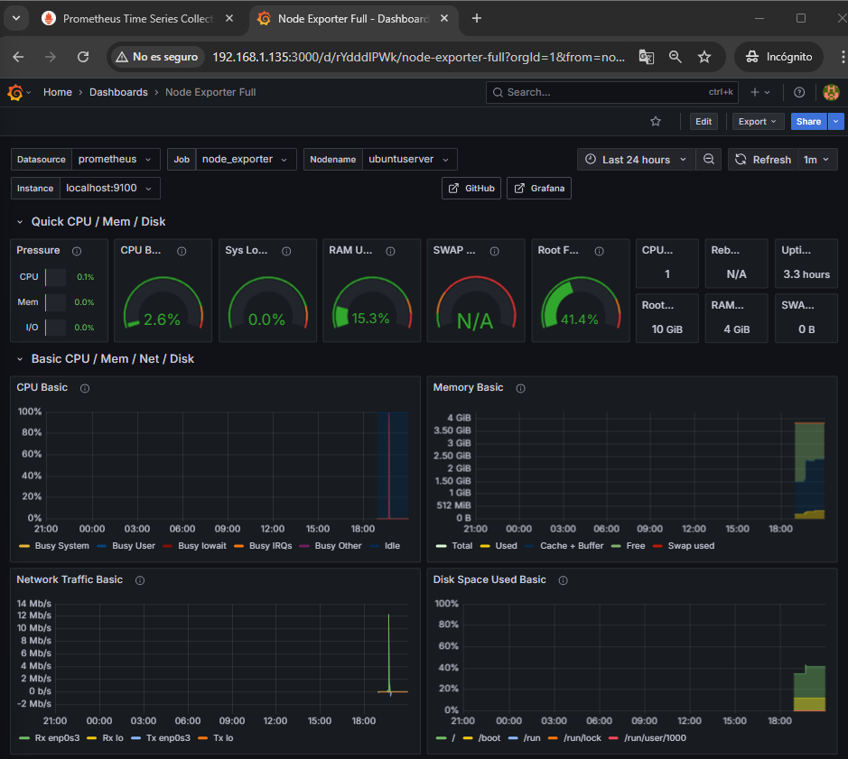

# Stack de Monitorización con Prometheus y Grafana

Este repositorio contiene el paso a paso para la implementación de un sistema de monitorización usando **Prometheus**, **Node Exporter** y **Grafana**, validando su instalación y configuración para el seguimiento de un servidor remoto.

---

## 🔧 1. Instalación de Node Exporter y Prometheus en el Servidor

### Paso 1: Crear usuario Prometheus
```bash
sudo useradd --no-create-home --shell /bin/false prometheus
```

### Paso 2: Descargar Prometheus
```bash
wget https://github.com/prometheus/prometheus/releases/download/v2.52.0/prometheus-2.52.0.linux-amd64.tar.gz
tar -xvzf prometheus-2.52.0.linux-amd64.tar.gz
cd prometheus-2.52.0.linux-amd64
```

### Paso 3: Mover binarios y asignación de permisos
```bash
sudo mv prometheus promtool /usr/local/bin/
sudo mkdir /etc/prometheus /var/lib/prometheus
sudo chown -R prometheus:prometheus /etc/prometheus /var/lib/prometheus
sudo cp -r consoles/ console_libraries/ prometheus.yml /etc/prometheus/
```

### Paso 4: Crear servicio systemd para Prometheus 

Para ello debemos crear el archivo del servicio en la siguiente ruta 
```bash
sudo nano /etc/systemd/system/prometheus.service
```

```ini
[Unit]
Description=Prometheus
Wants=network-online.target
After=network-online.target

[Service]
User=prometheus
ExecStart=/usr/local/bin/prometheus \
  --config.file=/etc/prometheus/prometheus.yml \
  --storage.tsdb.path=/var/lib/prometheus

[Install]
WantedBy=default.target
```

### Paso 5: Inicializar servicio Prometheus
```bash
sudo systemctl daemon-reload
sudo systemctl enable --now prometheus
sudo systemctl restart prometheus
sudo systemctl status prometheus
```

 

### Paso 6: Instalar Node Exporter
```bash
wget https://github.com/prometheus/node_exporter/releases/download/v1.9.1/node_exporter-1.9.1.linux-amd64.tar.gz
tar -xvzf node_exporter-1.9.1.linux-amd64.tar.gz
cd node_exporter-1.9.1.linux-amd64
sudo mv node_exporter /usr/local/bin/
```

### Paso 7: Crear servicio systemd para Node Exporter 

Para ello debemos crear el archivo del servicio en la siguiente ruta 
```bash
sudo nano /etc/systemd/system/node_exporter.service
```

```ini
[Unit]
Description=Node Exporter
After=network.target

[Service]
User=prometheus
ExecStart=/usr/local/bin/node_exporter

[Install]
WantedBy=default.target
```

```bash
sudo systemctl daemon-reload
sudo systemctl enable --now node_exporter
sudo systemctl restart node_exporter
sudo systemctl status node_exporter
```

 

---

## 📷 Evidencias de Validación 

A continuación se presentan las capturas que demuestran la correcta instalación, configuración y funcionamiento del stack Prometheus + Node Exporter:


### 🟢 1. Prometheus detectando targets correctamente

En esta captura se muestra la interfaz web de Prometheus (`http://192.168.1.135:9090/targets`), donde se confirman dos cosas:

- El servicio de `node_exporter` está siendo scrapeado correctamente (`localhost:9100`)
- El propio Prometheus también aparece como target (`localhost:9090`)
- Ambos se encuentran en estado `UP`, lo que confirma una recogida de métricas exitosa.

 

---

### 📊 2. Visualización de métricas en Prometheus

La segunda evidencia muestra la pestaña **Graph** de Prometheus con la métrica, la cual refleja el tiempo de CPU utilizado por núcleo. La curva ascendente confirma que Prometheus está registrando y graficando datos en tiempo real desde `node_exporter`. 

 

--- 


## 🧭 2. Instalación de Grafana

### Paso 1: Añadir repositorio
```bash
sudo apt install -y software-properties-common
sudo add-apt-repository "deb https://packages.grafana.com/oss/deb stable main"
sudo apt-get install -y grafana
```

### Paso 2: Iniciar y habilitar Grafana
```bash
sudo systemctl daemon-reload
sudo systemctl enable --now grafana-server
systemctl restart grafana-server
systemctl status grafana-server
```

 


### Paso 3: Acceder a Grafana

En nuestro caso accedemos a la interfaz web: `http://192.168.1.135:3000`
Usuario: **admin**
Contraseña: **admin** (pide cambiarla en el primer inicio)

---

## 📈 3. Configuración del Dashboard

### Paso 1: Añadir Prometheus

- Ir a `Connections` > `Data sources`.
- Hacer click en `+ Add new data source`.
- Elegir `Prometheus`.
- En nuestro caso en URL escribir:
```arduino
http://192.168.1.135:9090/
```
- Hacer click en **Save & Test**

 

### Paso 2: Importar el dashboard Node Exporter 

- Ir a `Dashboards`.
- Hacer click en `New` > `Import`.
- Importar el dashboard: `1860` (Node Exporter).
- Seleccionar el **Prometheus importado** anteriormente.
- Hacer click en **Import**

 


