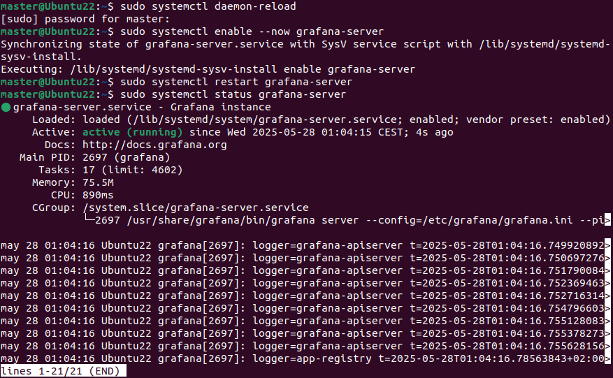
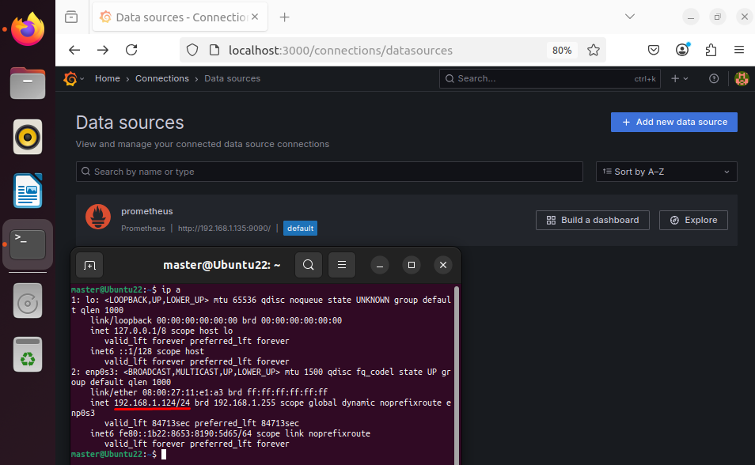
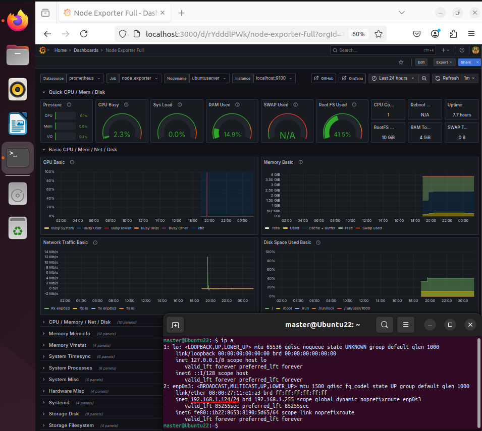

# RA5_3_2 — Stack de Monitorización Distribuido con Prometheus, Node Exporter y Grafana

Este documento describe la implementación de un sistema de monitorización distribuido en una arquitectura cliente-servidor. Se utiliza Prometheus y Node Exporter en el servidor, y Grafana en el cliente para la recolección remota de métricas y su visualización gráfica.

---

## 🧩 Arquitectura de la Actividad

| Rol      | IP               | Componentes instalados                  |
|----------|------------------|-----------------------------------------|
| Servidor | 192.168.1.135    | Prometheus + Node Exporter              |
| Cliente  | 192.168.1.124    | Grafana (con acceso remoto al servidor) |

---

## 🎯 Objetivo

Permitir que el equipo cliente con Ubuntu Desktop 22.04 consuma métricas generadas en el equipo servidor Ubuntu Server, monitorizando de forma remota el estado del sistema gracias a Grafana.

---

## 🖥️ 1. Preparación del servidor

Consultar el repositorio anterior [RA5_3_1](../RA5_3_1), donde se explica todo el proceso.

--- 

## 🖥️ 2. Instalación de Grafana en el cliente (Ubuntu Desktop 22.04)

```bash
sudo apt install -y apt-transport-https curl gnupg2
sudo mkdir -p /etc/apt/keyrings
curl -fsSL https://packages.grafana.com/gpg.key | sudo tee /etc/apt/keyrings/grafana.key > /dev/null
echo "deb [signed-by=/etc/apt/keyrings/grafana.key] https://packages.grafana.com/oss/deb stable main" | sudo tee /etc/apt/sources.list.d/grafana.list
sudo apt update
sudo apt install -y grafana
```

--- 

## 🚀 3. Habilitar y arrancar Grafana 

```bash
sudo systemctl daemon-reload
sudo systemctl enable --now grafana-server
sudo systemctl restart grafana-server
sudo systemctl status grafana-server
```

 

--- 

## 🌐 4. Acceso y configuración de Grafana 

### Paso 1: Añadir Prometheus

- Abrir la interfaz web en el cliente.

```arduino
http://localhost:3000
```

- Iniciar sesión con:

  - Usuario: **admin**.
  - Contraseña: **admin** (pide cambiarla en el primer inicio).

- Ir a `Connections` > `Data sources`.
- Hacer click en `+ Add new data source`.
- Seleccionar `Prometheus`.
- Agregar la URL del servidor remoto de Prometheus:
```arduino
http://192.168.1.135:9090/
```
- Hacer click en **Save & Test**

 

### Paso 2: 📊 Importar el Dashboard Node Exporter Full

- Ir a `Dashboards`.
- Hacer click en `New` > `Import`.
- Importar el dashboard: `1860` (Node Exporter).
- Seleccionar el **Prometheus importado** anteriormente.
- Hacer click en **Import**.



---

## ✅ Conclusión

Con este procedimiento se ha conseguido visualizar remotamente las métricas del servidor desde un cliente mediante Grafana, cumpliendo los objetivos de la actividad 3.2: monitorización distribuida, conexión remota segura y explotación gráfica de datos en tiempo real.

