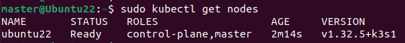
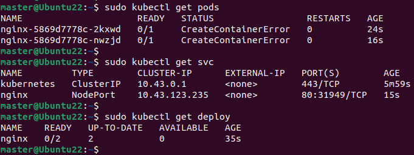
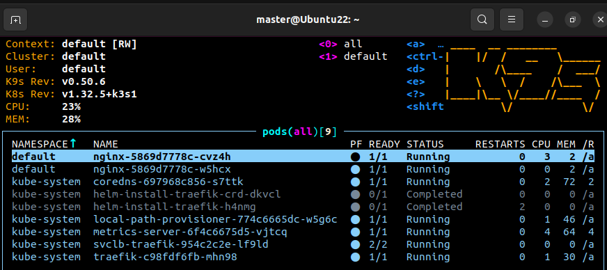

# RA5_4_1 - Instalación de K3s en Single-Node + nginx + K9s

## Objetivo

Instalar y configurar un clúster K3s en un solo nodo, desplegar un servicio NGINX con 2 réplicas y validar su funcionamiento utilizando la herramienta K9s.

---

## Paso 1: Preparar el entorno

### Requisitos:
- Sistema operativo: Ubuntu Server/Desktop 20.04 o superior
- Acceso con usuario con permisos sudo
- Conexión a internet activa

```bash
sudo apt update && sudo apt upgrade -y
```

---

## Paso 2: Instalar K3s (modo Single-Node)

```bash
curl -sfL https://get.k3s.io | sh -
```

> Esto instalará K3s y creará el archivo de configuración en `/etc/rancher/k3s/k3s.yaml`

### Verificar estado del servicio:
```bash
sudo systemctl status k3s
```

---

## Paso 3: Configurar kubectl

```bash
mkdir -p $HOME/.kube
sudo cp /etc/rancher/k3s/k3s.yaml $HOME/.kube/config
sudo chown $(id -u):$(id -g) $HOME/.kube/config
```

### Verificar conexión:
```bash
sudo kubectl get nodes
```

 

--- 

## Paso 4: Posible error AppArmor (CreateContainerError)

El sistema puede tener un problema con el sistema de seguridad **AppArmor**, que impide iniciar los contenedores porque no puede parsear correctamente un archivo de perfil.

Esto se debe a cómo `containerd` (el runtime de contenedores usado por K3s) interactúa con AppArmor.

### 🔧 Solución paso a paso: 

#### 1. Configurar K3s para ignorar AppArmor
```bash
sudo systemctl edit k3s
```
Y añade:
```ini
[Service]
Environment="CONTAINERD_DISABLE_APPARMOR=true"
```
Luego:
```bash
sudo systemctl daemon-reexec
sudo systemctl restart k3s
```
 
#### 2. (Si la solución anterior no funcionó) Desactivar AppArmor: 
```bash
sudo systemctl stop apparmor
sudo systemctl disable apparmor
sudo apt purge apparmor -y
sudo reboot
```

 
--- 

 
## Paso 5: Desplegar servicio NGINX con 2 réplicas

```bash
sudo kubectl create deployment nginx --image=nginx
sudo kubectl scale deployment nginx --replicas=2
```

### Es recomendable exponer el servicio:
```bash
sudo kubectl expose deployment nginx --port=80 --type=NodePort
```

### Verificar:
```bash
sudo kubectl get pods
sudo kubectl get svc
sudo kubectl get deploy
```



---

## Paso 6: Instalar K9s

```bash
curl -sS https://webinstall.dev/k9s | bash
```

> O descarga manualmente desde https://github.com/derailed/k9s/releases

### Activar ruta si no reconoce el comando:
```bash
source ~/.config/envman/PATH.env
```

### Ejecutar:
```bash
k9s
```

Donde podras:
- Navegar por los pods
- Ver logs
- Monitorizar el estado del clúster


 

 
---

## ✅ Conclusión

La instalación de K3s en modo single-node permite desplegar entornos de Kubernetes ligeros y funcionales de forma sencilla. El despliegue de un servicio como NGINX con múltiples réplicas y su monitorización con K9s demuestra la eficiencia de esta arquitectura para pruebas, desarrollo o incluso producción en entornos de bajo consumo. La resolución de errores comunes como los conflictos con AppArmor forma parte esencial del aprendizaje práctico.

---

## 📚 Recursos

- [Documentación oficial de K3s](https://k3s.io/)
- [K9s CLI](https://k9scli.io/)
- [Kubernetes - kubectl](https://kubernetes.io/docs/reference/kubectl/overview/)
- [Artículo sobre AppArmor y contenedores](https://wiki.ubuntu.com/AppArmor)
