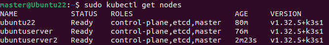
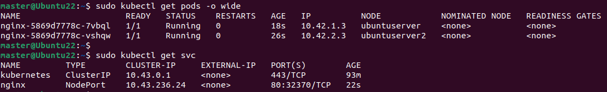
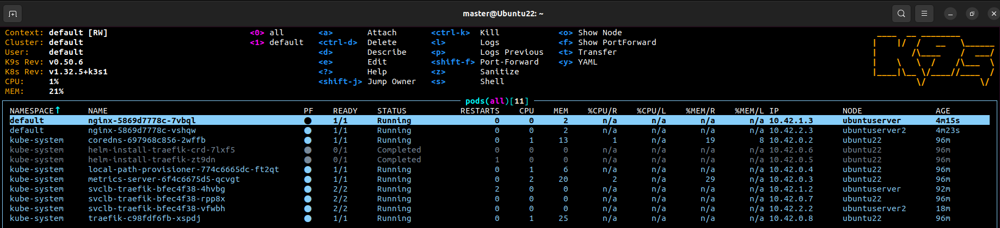

# RA5_4_2 - Instalación de K3s en HA + nginx + K9s

## 🎯 Objetivo

Instalar un clúster K3s en alta disponibilidad (HA) usando `etcd` embebido, desplegar NGINX con 2 réplicas y verificar el estado con K9s.

---

## 🧩 Escenario recomendado
- 3 nodos (máquinas virtuales o físicas) con Ubuntu 20.04 o superior.
- Red común entre ellos
- Acceso SSH o físico con permisos sudo

---

## Paso 1: Preparar todos los nodos

### En todos los nodos: 

Actualizar el sistema
```bash
sudo apt update && sudo apt upgrade -y
```

Cada sistema debe nombrarse de forma distinta, para evitar conflictos, modificar los archivos:
```bash
sudo nano /etc/hostname
sudo nano /etc/hosts
```
 
---

## Paso 2: Instalar el nodo inicial (Ubuntu Desktop 22.04)

### En el primer nodo:
```bash
curl -sfL https://get.k3s.io | INSTALL_K3S_EXEC="--cluster-init" sh -
```

> Este nodo inicia el clúster con etcd embebido.

Obtenemos el token:
```bash
sudo cat /var/lib/rancher/k3s/server/node-token
```
 


Obtenemos su IP para conectarlo desde otros nodos:
```bash
ip a | grep inet
```
> La IP obtenida es la **192.168.1.136**
 
 
--- 

## Paso 3: Añadir más nodos al plano de control (Ubuntu Server 2 y 3)

### En los demás nodos:
```bash
curl -sfL https://get.k3s.io | \
K3S_URL="https://192.168.1.136:6443" \
K3S_TOKEN="K109c43f17909e4d7c06eec3bd06b62dc26a493ebbd2c6c3d356f70b605fa7b3955::server:2fd3225eed859d7f20bf253849ee6476" \
INSTALL_K3S_EXEC="server" \
sh -
```

> Estos son los valores obtenidos en mi caso, en vuestro caso serán distintos.

---

## Paso 4: Verificar estado del clúster

En cualquiera de los nodos:
```bash
sudo kubectl get nodes
```



---

## Paso 5: Desplegar servicio NGINX 

### Ejecutar en el nodo principal: 
```bash
kubectl create deployment nginx --image=nginx
kubectl scale deployment nginx --replicas=2
kubectl expose deployment nginx --port=80 --type=NodePort
```

### Verificar el estado del servicio:
```bash
sudo kubectl get pods -o wide
sudo kubectl get svc
```

 


---

## Paso 6: Instalar y usar K9s

### Configuramos `kubectl` para ejecutar con los permisos adecuados:
```bash
mkdir -p $HOME/.kube
sudo cp /etc/rancher/k3s/k3s.yaml $HOME/.kube/config
sudo chown $(id -u):$(id -g) $HOME/.kube/config
```


```bash
curl -sS https://webinstall.dev/k9s | bash
source ~/.config/envman/PATH.env
k9s
```

 


--- 
 
## ✅ Conclusión

Se ha permitido configurar con éxito un clúster K3s en alta disponibilidad (HA), con tres nodos `server` activos que comparten la responsabilidad del control-plane y el almacenamiento distribuido (etcd). 

El despliegue de NGINX en este entorno ha demostrado la capacidad del clúster para mantener disponibilidad y balancear la carga de trabajo. Además, se reforzaron buenas prácticas como la gestión de nombres de nodo únicos y la resolución de conflictos de configuración. K9s ha facilitado la verificación del estado del clúster de forma visual y efectiva desde consola. 
 
--- 
 
## 📚 Recursos 

- [K3s - HA Installation Docs](https://docs.k3s.io/installation/ha/)
- [K9s - Kubernetes Terminal UI](https://k9scli.io/)
- [Documentación oficial de Kubernetes](https://kubernetes.io/)
- [Artículo sobre K3s HA (Medium)](https://medium.com/@wasiualhasib/building-a-home-lab-with-k3s-a-cost-effective-approach-to-learning-kubernetes-39fe8d372633)
- [Solución a conflictos de hostname duplicado en K3s](https://github.com/k3s-io/k3s/issues/1787)

